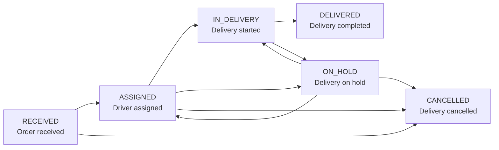

# DeliveryFlow

[한국어](README-ko.md)

DeliveryFlow is an operations-focused delivery management API. It manages the delivery workflow from order reception and driver assignment to status updates and completion-history tracking.

The project modernizes previous delivery-reception domain experience with Spring Boot, emphasizing operational reliability, access control, and auditability.

## Project Goals

- Implement order reception and driver assignment workflows as REST APIs.
- Prevent invalid delivery status changes and retain a history of every change.
- Separate administrator and driver permissions.
- Build a production-minded backend with tests, API documentation, Docker, and CI/CD.

## Key Features

- Order creation and lookup
- Driver assignment and reassignment
- Delivery status updates
- Delivery history and operational notes
- Administrator delivery dashboard
- Public delivery tracking

## Delivery Status Flow



`DELIVERED` and `CANCELLED` are final statuses and cannot be changed afterward.

## Tech Stack

| Category | Technology |
|---|---|
| Language | Java 17 |
| Framework | Spring Boot 3.x |
| Database | PostgreSQL |
| Data Access | Spring Data JPA |
| Security | Spring Security, JWT |
| API Documentation | Swagger / OpenAPI |
| Test | JUnit 5, Mockito |
| Deployment | Docker, GitHub Actions |

## Development Roadmap

| Phase | Scope | Status |
|---|---|---|
| 1 | Project setup; order creation and lookup API | Planned |
| 2 | Driver assignment and delivery status updates | Planned |
| 3 | Authentication, authorization, and delivery history | Planned |
| 4 | Search, dashboard, and error handling | Planned |
| 5 | Tests, Docker, CI/CD, and deployment | Planned |

## Documentation

- [Project Specification (English)](docs/deliveryflow-portfolio-spec.md)
- [프로젝트 한글 명세서](docs/deliveryflow-portfolio-spec-ko.md)

## Running the Application

The following command will be available once the application has been implemented:

```bash
./gradlew bootRun
```

## Planned Package Structure

```text
src/main/java/com/deliveryflow
├── auth          # Authentication and authorization
├── user          # Users and drivers
├── order         # Order reception
├── delivery      # Deliveries, status updates, and history
└── common        # Shared configuration, exceptions, and responses
```

## Core Design Principles

- Drivers can access and modify only deliveries assigned to them.
- Every status change records the previous status, new status, actor, timestamp, and reason.
- A reason is required when a delivery is put on hold or cancelled.
- Optimistic locking is used to reduce data conflicts caused by concurrent updates.

## Future Improvements

- Daily workload statistics by driver
- Analysis of delivery-failure reasons
- Notification capability
- Customer-facing tracking UI
- Deployment monitoring and log management

