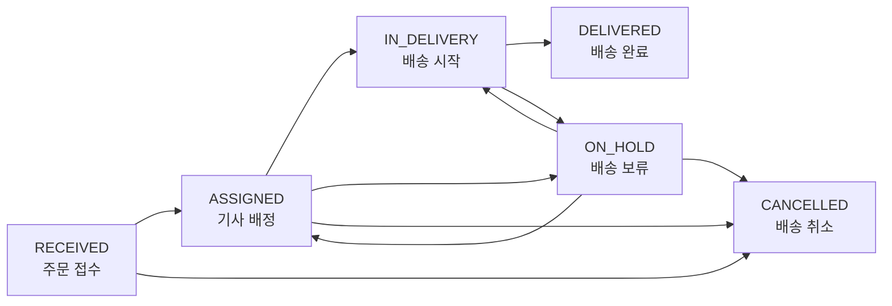

# DeliveryFlow`r`n`r`n[English](README-en.md)

배송 접수부터 기사 배정, 배송 상태 관리, 완료 이력 조회까지 지원하는 배송 운영 관리 API 프로젝트입니다.

과거 배송 접수 시스템 개발 경험을 바탕으로, 운영 환경에서 중요한 상태 전이 검증, 역할별 권한 관리, 변경 이력 보관을 Spring Boot 기반으로 재구성합니다.

## 프로젝트 목표

- 주문 접수와 배송 기사 배정 업무를 API로 구현합니다.
- 잘못된 배송 상태 변경을 막고 모든 변경 이력을 남깁니다.
- 관리자와 배송 기사의 접근 권한을 구분합니다.
- 테스트, API 문서화, Docker, CI/CD까지 적용해 운영 가능한 백엔드 서비스를 만듭니다.

## 주요 기능

- 주문 등록 및 조회
- 배송 기사 배정 및 재배정
- 배송 상태 변경
- 배송 이력 및 운영 메모 관리
- 관리자 배송 현황 조회
- 고객 배송 조회

## 배송 상태 흐름



`DELIVERED`와 `CANCELLED` 상태는 최종 상태이므로 이후 변경할 수 없습니다.

## 기술 스택

| 구분 | 기술 |
|---|---|
| Language | Java 17 |
| Framework | Spring Boot 3.x |
| Database | PostgreSQL |
| Data Access | Spring Data JPA |
| Security | Spring Security, JWT |
| API Documentation | Swagger / OpenAPI |
| Test | JUnit 5, Mockito |
| Deployment | Docker, GitHub Actions |

## 개발 계획

| 단계 | 내용 | 상태 |
|---|---|---|
| 1 | 프로젝트 설정 및 주문 등록·조회 API | 진행 예정 |
| 2 | 기사 배정 및 배송 상태 변경 | 진행 예정 |
| 3 | 로그인·권한 관리 및 배송 이력 | 진행 예정 |
| 4 | 검색·대시보드·예외 처리 | 진행 예정 |
| 5 | 테스트·Docker·CI/CD 배포 | 진행 예정 |

## 문서

- [프로젝트 한글 명세서](docs/deliveryflow-portfolio-spec-ko.md)
- [Project Specification (English)](docs/deliveryflow-portfolio-spec.md)

## 실행 방법

프로젝트 구현 후 아래 내용을 보완할 예정입니다.

```bash
./gradlew bootRun
```

## 프로젝트 구조

```text
src/main/java/com/deliveryflow
├── auth          # 인증과 인가
├── user          # 사용자와 배송 기사
├── order         # 주문 접수
├── delivery      # 배송, 상태 변경, 이력
└── common        # 공통 설정, 예외, 응답 형식
```

## 핵심 설계 원칙

- 배송 기사는 자신에게 배정된 배송만 조회하고 수정할 수 있습니다.
- 상태 변경 시 이전 상태, 변경 상태, 변경자, 변경 시각, 사유를 이력으로 저장합니다.
- 보류 및 취소 시에는 사유를 반드시 입력해야 합니다.
- 동시 수정으로 인한 데이터 충돌을 줄이기 위해 낙관적 락을 적용합니다.

## 향후 개선 계획

- 배송 기사별 당일 업무량 통계
- 배송 실패 사유 분석
- 알림 기능
- 고객용 배송 조회 화면
- 배포 환경 모니터링 및 로그 관리

