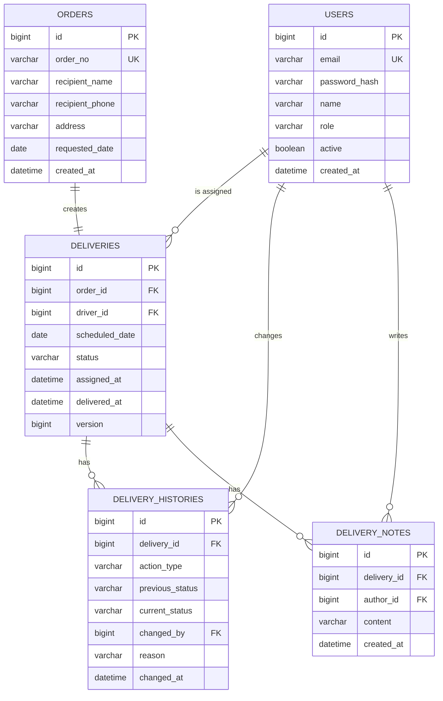
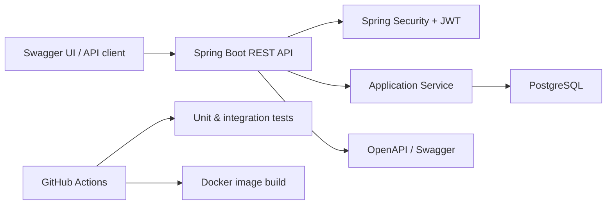

# DeliveryFlow - Portfolio Project Specification

## 1. Project overview

**DeliveryFlow** is an operations-focused delivery management API that manages the flow from order reception through driver assignment, delivery progress, and completion. It is designed as a portfolio project that modernizes prior delivery-reception domain experience using Spring Boot.

### 1.1 Problem to solve

Delivery operations need a reliable record of who changed a delivery, when it changed, and why. The system prevents invalid status changes, restricts drivers to their own work items, and retains an auditable history for every operational change.

### 1.2 Target users

| User | Main responsibilities |
|---|---|
| Administrator | Register orders, assign drivers, manage delivery schedules, view all operational records and dashboard data. |
| Driver | View assigned deliveries and update the delivery status with a reason when required. |
| Customer | Track a delivery by order number and phone-number suffix without signing in. |

### 1.3 First-release scope

- Authentication and role-based access control for administrators and drivers
- Order reception, delivery creation, and driver assignment
- Delivery status updates and immutable status history
- Search, pagination, basic operational dashboard, and public tracking
- API documentation, tests, Docker execution, and automated build/test workflow

Out of scope for the first release: payment, route optimization, live GPS tracking, notifications, multi-stop deliveries, and a customer-facing UI.

## 2. Business rules

### 2.1 Delivery statuses

| Status | Meaning | Allowed next status |
|---|---|---|
| `RECEIVED` | Order was received; a driver is not assigned. | `ASSIGNED`, `CANCELLED` |
| `ASSIGNED` | A driver and scheduled date have been assigned. | `IN_DELIVERY`, `ON_HOLD`, `CANCELLED` |
| `IN_DELIVERY` | Driver has started delivery. | `DELIVERED`, `ON_HOLD` |
| `ON_HOLD` | Delivery is temporarily paused. A reason is required. | `ASSIGNED`, `IN_DELIVERY`, `CANCELLED` |
| `DELIVERED` | Delivery has been completed. | None |
| `CANCELLED` | Delivery has been cancelled. A reason is required. | None |

### 2.2 Authorization rules

- Only administrators can create orders, assign or reassign drivers, cancel a delivery, and view all deliveries.
- Drivers can view only deliveries assigned to themselves.
- Drivers can change an assigned delivery only to `IN_DELIVERY`, `DELIVERED`, or `ON_HOLD` when the transition is valid.
- A completed or cancelled delivery cannot be edited or reassigned.
- Every assignment and status change creates a history record. History records are never updated or deleted.

### 2.3 Validation rules

- `orderNo` is unique and generated by the server: `ORD-YYYYMMDD-XXXX`.
- A driver must have the `DRIVER` role and must be active before assignment.
- A scheduled delivery date cannot be before the order creation date.
- `reason` is required for `ON_HOLD` and `CANCELLED`.
- The public tracking endpoint requires both the order number and the final four digits of the recipient phone number.

## 3. Domain model



### 3.1 Entity notes

- `orders` retains the original request details; the current operational state lives in `deliveries`.
- `deliveries.order_id` is unique to enforce one delivery per order in the first release.
- `deliveries.version` is used for optimistic locking to prevent simultaneous updates from overwriting one another.
- `delivery_histories.action_type` values: `ASSIGNED`, `REASSIGNED`, `STATUS_CHANGED`, `CANCELLED`.

## 4. API specification

Base URL: `/api/v1`  
Authentication: `Authorization: Bearer {accessToken}` for protected endpoints.

| Feature | Method | Endpoint | Role |
|---|---|---|---|
| Sign in | `POST` | `/auth/login` | Public |
| Create user | `POST` | `/users` | Admin |
| Create order | `POST` | `/orders` | Admin |
| List orders | `GET` | `/orders?keyword=&page=&size=` | Admin |
| Get order detail | `GET` | `/orders/{orderId}` | Admin |
| List drivers | `GET` | `/drivers` | Admin |
| Assign driver | `POST` | `/deliveries` | Admin |
| Reassign driver | `PATCH` | `/deliveries/{deliveryId}/assignment` | Admin |
| List all deliveries | `GET` | `/deliveries?status=&driverId=&date=` | Admin |
| List my deliveries | `GET` | `/deliveries/me?date=` | Driver |
| Update delivery status | `PATCH` | `/deliveries/{deliveryId}/status` | Admin, assigned Driver |
| Get delivery history | `GET` | `/deliveries/{deliveryId}/histories` | Admin, assigned Driver |
| Add operational note | `POST` | `/deliveries/{deliveryId}/notes` | Admin, assigned Driver |
| Track delivery | `GET` | `/tracking/{orderNo}?phoneLast4=` | Public |
| Dashboard summary | `GET` | `/dashboard/delivery-status?date=` | Admin |

### 4.1 Essential request examples

Create an order:

```json
POST /api/v1/orders
{
  "recipientName": "Minji Kim",
  "recipientPhone": "010-1234-5678",
  "address": "101 Teheran-ro, Gangnam-gu, Seoul",
  "requestedDate": "2026-09-01"
}
```

Assign a delivery:

```json
POST /api/v1/deliveries
{
  "orderId": 101,
  "driverId": 12,
  "scheduledDate": "2026-09-01"
}
```

Update delivery status:

```text
PATCH /api/v1/deliveries/501/status?status=ON_HOLD&reason=Recipient%20unavailable
```

In Swagger, select `status` from the available values. Enter `reason` only for `ON_HOLD` or `CANCELLED`.

### 4.2 Standard error response

```json
{
  "code": "INVALID_STATUS_TRANSITION",
  "message": "DELIVERED deliveries cannot be updated.",
  "timestamp": "2026-08-12T10:30:00",
  "path": "/api/v1/deliveries/501/status"
}
```

## 5. Architecture and implementation plan



Recommended package structure:

```text
com.deliveryflow
  auth/
  user/
  order/
  delivery/
    api/
    application/
    domain/
    infrastructure/
  common/
    config/
    exception/
    response/
```

## 6. Acceptance checklist for Week 1

- [ ] README includes project goal, scope, and business flow.
- [ ] ERD is committed as a Mermaid diagram or image.
- [ ] Status transition rules and role permissions are documented.
- [ ] API endpoints and sample requests are documented.
- [ ] First GitHub issue list is created: authentication, order, assignment, status history, search/dashboard, deployment.

## 7. Interview talking points

> I recreated a delivery-reception domain as a Spring Boot API, focusing on operational reliability rather than only CRUD features. The design prevents invalid delivery state transitions, limits drivers to their assigned deliveries, and keeps an immutable audit history for every assignment and status update. I also used optimistic locking to address concurrent operational updates.

