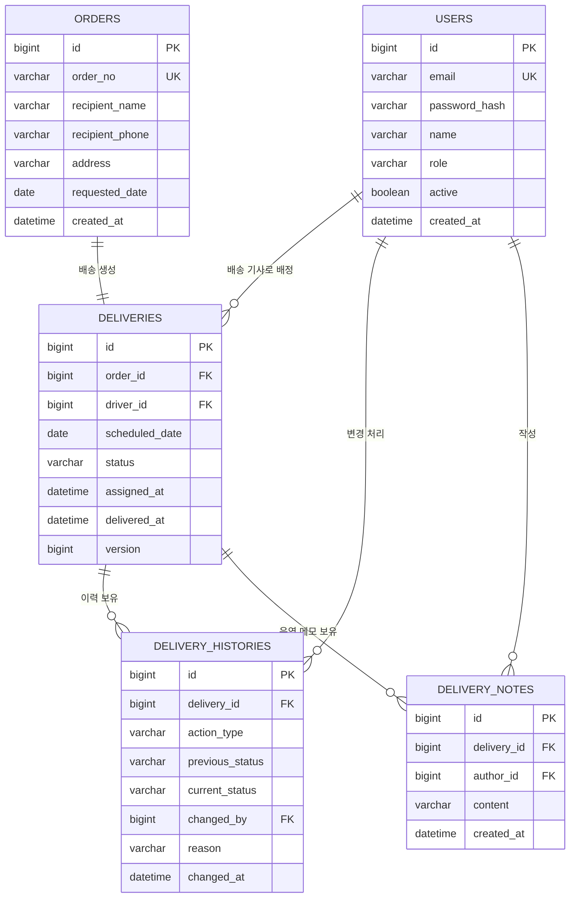
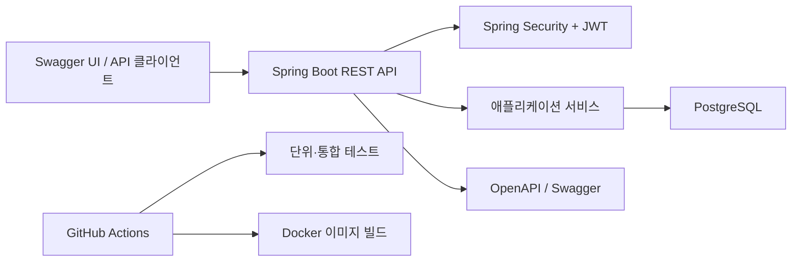

# DeliveryFlow - 포트폴리오 프로젝트 명세서

## 1. 프로젝트 개요

**DeliveryFlow**는 주문 접수부터 기사 배정, 배송 진행, 완료까지의 흐름을 관리하는 운영 중심 배송 관리 API입니다. 기존의 배송 접수 도메인 경험을 Spring Boot 기반으로 현대화한 포트폴리오 프로젝트입니다.

### 1.1 해결하려는 문제

배송 운영에서는 누가, 언제, 어떤 사유로 배송 상태를 바꾸었는지 신뢰할 수 있게 기록해야 합니다. 이 시스템은 잘못된 상태 변경을 막고, 배송 기사가 본인 업무만 처리하게 하며, 모든 운영 변경 이력을 남깁니다.

### 1.2 사용자

| 사용자 | 주요 역할 |
|---|---|
| 관리자 | 주문 등록, 기사 배정, 배송 일정 관리, 전체 운영 현황과 이력 조회 |
| 배송 기사 | 본인에게 배정된 배송 조회 및 배송 상태 변경 |
| 고객 | 로그인 없이 주문번호와 연락처 일부로 배송 상태 조회 |

### 1.3 1차 개발 범위

- 관리자와 배송 기사 대상 로그인 및 역할 기반 권한 관리
- 주문 접수, 배송 생성, 기사 배정
- 배송 상태 변경 및 변경 이력의 영구 보관
- 검색, 페이징, 기본 운영 현황, 고객 배송 조회
- API 문서화, 테스트, Docker 실행, 자동 빌드·테스트 구성

1차 개발에서 제외할 범위: 결제, 최적 경로 계산, 실시간 GPS 추적, 알림, 다중 배송지 처리, 고객용 화면입니다.

## 2. 업무 규칙

### 2.1 배송 상태

| 상태 | 의미 | 변경 가능한 다음 상태 |
|---|---|---|
| `RECEIVED` | 주문은 접수되었지만 기사가 배정되지 않은 상태 | `ASSIGNED`, `CANCELLED` |
| `ASSIGNED` | 기사와 배송 예정일이 배정된 상태 | `IN_DELIVERY`, `ON_HOLD`, `CANCELLED` |
| `IN_DELIVERY` | 기사가 배송을 시작한 상태 | `DELIVERED`, `ON_HOLD` |
| `ON_HOLD` | 배송이 일시 보류된 상태. 사유 필수 | `ASSIGNED`, `IN_DELIVERY`, `CANCELLED` |
| `DELIVERED` | 배송 완료 상태 | 없음 |
| `CANCELLED` | 배송 취소 상태. 사유 필수 | 없음 |

### 2.2 권한 규칙

- 관리자는 주문 등록, 기사 배정·재배정, 배송 취소, 전체 배송 조회를 할 수 있습니다.
- 배송 기사는 본인에게 배정된 배송만 조회할 수 있습니다.
- 배송 기사는 유효한 상태 전이일 때만 본인 배송을 `IN_DELIVERY`, `DELIVERED`, `ON_HOLD`로 변경할 수 있습니다.
- 완료 또는 취소된 배송은 수정하거나 재배정할 수 없습니다.
- 배정과 상태 변경이 발생할 때마다 이력 레코드를 생성하며, 생성된 이력은 수정하거나 삭제하지 않습니다.

### 2.3 검증 규칙

- `orderNo`는 서버가 `ORD-YYYYMMDD-XXXX` 형식으로 생성하며 중복될 수 없습니다.
- 배정 대상 사용자는 `DRIVER` 역할이며 활성 상태여야 합니다.
- 배송 예정일은 주문 생성일보다 이전일 수 없습니다.
- `ON_HOLD`와 `CANCELLED` 상태 변경에는 `reason`이 반드시 필요합니다.
- 고객 배송 조회에는 주문번호와 수령인 연락처 끝 4자리를 함께 입력해야 합니다.

## 3. 데이터 모델



### 3.1 엔티티 설계 메모

- `orders`에는 최초 주문 요청 정보를 보관하고, 현재 배송 운영 상태는 `deliveries`에서 관리합니다.
- 1차 개발에서는 주문 하나당 배송 하나만 생성할 수 있도록 `deliveries.order_id`에 유니크 제약을 둡니다.
- `deliveries.version`은 낙관적 락에 사용합니다. 여러 운영자가 동시에 수정할 때 마지막 수정이 다른 변경을 덮어쓰는 문제를 방지합니다.
- `delivery_histories.action_type` 값: `ASSIGNED`, `REASSIGNED`, `STATUS_CHANGED`, `CANCELLED`.

## 4. API 명세

기본 경로: `/api/v1`  
인증: 보호된 API 호출 시 `Authorization: Bearer {accessToken}` 헤더를 사용합니다.

| 기능 | 메서드 | 경로 | 권한 |
|---|---|---|---|
| 로그인 | `POST` | `/auth/login` | 공개 |
| 사용자 생성 | `POST` | `/users` | 관리자 |
| 주문 등록 | `POST` | `/orders` | 관리자 |
| 주문 목록 조회 | `GET` | `/orders?keyword=&page=&size=` | 관리자 |
| 주문 상세 조회 | `GET` | `/orders/{orderId}` | 관리자 |
| 배송 기사 목록 | `GET` | `/drivers` | 관리자 |
| 기사 배정 | `POST` | `/deliveries` | 관리자 |
| 기사 재배정 | `PATCH` | `/deliveries/{deliveryId}/assignment` | 관리자 |
| 전체 배송 목록 | `GET` | `/deliveries?status=&driverId=&date=` | 관리자 |
| 내 배송 목록 | `GET` | `/deliveries/me?date=` | 배송 기사 |
| 배송 상태 변경 | `PATCH` | `/deliveries/{deliveryId}/status` | 관리자, 배정 기사 |
| 배송 이력 조회 | `GET` | `/deliveries/{deliveryId}/histories` | 관리자, 배정 기사 |
| 운영 메모 등록 | `POST` | `/deliveries/{deliveryId}/notes` | 관리자, 배정 기사 |
| 고객 배송 조회 | `GET` | `/tracking/{orderNo}?phoneLast4=` | 공개 |
| 배송 현황 대시보드 | `GET` | `/dashboard/delivery-status?date=` | 관리자 |

### 4.1 주요 요청 예시

주문 등록:

```json
POST /api/v1/orders
{
  "recipientName": "김민지",
  "recipientPhone": "010-1234-5678",
  "address": "서울특별시 강남구 테헤란로 101",
  "requestedDate": "2026-09-01"
}
```

배송 기사 배정:

```json
POST /api/v1/deliveries
{
  "orderId": 101,
  "driverId": 12,
  "scheduledDate": "2026-09-01"
}
```

배송 상태 변경:

```text
PATCH /api/v1/deliveries/501/status?status=ON_HOLD&reason=수령인%20부재로%20저녁%20배송%20요청
```

Swagger에서는 `status`를 목록에서 선택합니다. `reason`은 `ON_HOLD`, `CANCELLED`일 때만 입력합니다.

### 4.2 표준 오류 응답

```json
{
  "code": "INVALID_STATUS_TRANSITION",
  "message": "DELIVERED 상태의 배송은 수정할 수 없습니다.",
  "timestamp": "2026-08-12T10:30:00",
  "path": "/api/v1/deliveries/501/status"
}
```

## 5. 구조와 구현 계획



권장 패키지 구조:

```text
com.deliveryflow
  auth/
  user/
  order/
  delivery/
    api/
    application/
    domain/
    infrastructure/
  common/
    config/
    exception/
    response/
```

## 6. 1주차 완료 기준

- [ ] README에 프로젝트 목표, 개발 범위, 업무 흐름을 작성합니다.
- [ ] Mermaid 다이어그램 또는 이미지 형태의 ERD를 저장소에 등록합니다.
- [ ] 상태 전이 규칙과 역할별 권한을 문서화합니다.
- [ ] API 목록과 주요 요청 예시를 문서화합니다.
- [ ] GitHub Issue를 생성합니다: 인증, 주문, 기사 배정, 상태 이력, 검색·대시보드, 배포.

## 7. 면접에서 설명할 핵심 내용

> 기존 배송 접수 도메인 경험을 Spring Boot API로 재구성했습니다. 단순 CRUD 기능보다 운영 안정성에 중점을 두어, 잘못된 배송 상태 변경을 막고 배송 기사가 본인 건만 처리하도록 권한을 제한했습니다. 또한 모든 배정과 상태 변경에 변경 이력을 남겼고, 동시 수정 문제를 줄이기 위해 낙관적 락을 적용했습니다.

