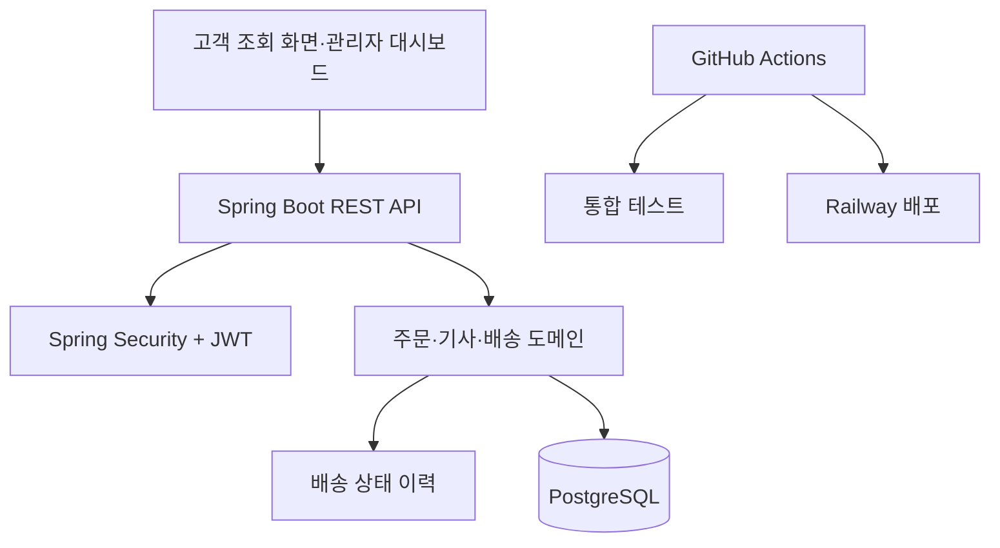

# DeliveryFlow 포트폴리오 발표·면접 요약

## 1. 프로젝트 소개

DeliveryFlow는 배송 접수부터 기사 배정, 배송 상태 변경, 고객 배송 조회까지 연결한 배송 운영 관리 서비스입니다. 단순 CRUD를 넘어, 실제 운영에서 문제가 되기 쉬운 **권한**, **상태 전이**, **변경 이력**, **배포와 검증**을 함께 구현했습니다.

## 2. 사용자별 문제 해결

| 사용자 | 요구 | 구현 방식 |
|---|---|---|
| 고객 | 로그인 없이 현재 배송 상태를 안전하게 조회 | 주문번호 또는 추적번호와 수령인 전화번호를 함께 검증 |
| 관리자 | 주문·기사·배송을 운영하고 전체 현황을 파악 | ADMIN JWT 권한, 7일 범위 대시보드, 상태별 상세 목록 |
| 배송 기사 | 본인 배송을 확인하고 현장 상태를 반영 | 본인에게 배정된 배송만 조회, 허용 상태로만 변경 |

## 3. 핵심 설계

### 상태 전이 검증

배송 상태를 아무 값으로나 바꾸지 못하게 도메인 객체에서 전이를 검증합니다.

- `ASSIGNED` → `IN_DELIVERY`, `ON_HOLD`, `CANCELLED`
- `IN_DELIVERY` → `DELIVERED`, `ON_HOLD`
- `ON_HOLD` → `ASSIGNED`, `IN_DELIVERY`, `CANCELLED`
- `DELIVERED`, `CANCELLED`는 최종 상태

보류와 취소는 운영 사유를 반드시 받으며, 변경 전·후 상태와 변경자·시각을 이력으로 저장합니다.

### 권한 설계

- JWT의 역할 정보를 바탕으로 API 접근을 구분합니다.
- 관리자는 배송 운영 기능과 현황 데이터를 이용할 수 있습니다.
- 기사는 자신의 배송만 조회·변경할 수 있습니다.
- 고객 조회 API는 공개하되, 수령인 전화번호를 추가 검증해 배송 정보의 노출 범위를 줄였습니다.

### 오류 메시지 다국어 처리

예외 발생 위치에서 한글 문장을 직접 만들지 않고 메시지 키와 인자를 전달합니다. 공통 예외 처리기가 `Accept-Language` 요청 헤더에 맞춰 한국어 또는 영어 메시지를 응답합니다. 이 방식은 새 언어를 추가하거나 문구를 수정할 때 비즈니스 코드를 건드리지 않아도 되는 장점이 있습니다.

## 4. 검증 방법

1. JUnit 기반 서비스·통합 테스트를 실행합니다.
2. PowerShell 통합 테스트로 로그인부터 주문 등록, 기사 배정, 상태 변경, 고객 조회까지 실제 API 흐름을 검증합니다.
3. Docker Compose로 애플리케이션과 PostgreSQL을 함께 실행합니다.
4. GitHub Actions에서 변경 시 자동 테스트를 수행합니다.
5. Railway 운영 환경에서 관리자 화면, 주문 등록·조회, 고객 배송 조회를 외부 접속으로 확인합니다.

## 5. 면접에서 설명할 수 있는 포인트

### 왜 배송 상태를 별도 검증했나요?

상태 값만 수정하는 일반적인 CRUD는 완료된 배송을 다시 배송 중으로 바꾸는 등의 운영 오류를 막지 못합니다. 허용 전이를 도메인에 명시해 잘못된 변경을 HTTP 400과 표준 오류 코드로 막았습니다.

### 주문 ID와 주문번호·추적번호를 분리한 이유는 무엇인가요?

내부 식별자인 숫자 ID는 관계와 조회 성능에 사용합니다. 사용자에게 노출되는 주문번호와 추적번호는 의미 있는 업무 식별자이므로 별도로 둡니다. 향후 규모가 커져 식별자 생성 방식을 바꾸더라도 내부 ID 체계를 옮기지 않고 업무 번호 정책만 확장할 수 있습니다.

### 고객 배송 조회는 왜 전화번호를 요구하나요?

주문번호만으로 조회되면 번호를 아는 제3자가 배송 정보를 볼 수 있습니다. 수령인 전화번호를 함께 확인하고, 화면에는 주소·기사 정보 같은 불필요한 개인정보를 보여 주지 않습니다.

### 왜 JWT를 sessionStorage에만 저장했나요?

간단한 관리자 화면에서 새로고침 중 로그인 상태를 유지하면서도, 탭을 닫으면 토큰이 사라지게 하기 위한 선택입니다. 운영 서비스로 확장한다면 XSS 방어 정책, 짧은 만료 시간, 재발급 전략과 함께 HttpOnly Secure 쿠키 방식도 검토할 수 있습니다.

### 다음 개선 과제는 무엇인가요?

현재 JPA의 스키마 자동 갱신에 의존하는 부분을 Flyway 마이그레이션으로 전환해 데이터베이스 구조 변경 이력을 관리하는 것입니다. 그다음으로는 모니터링, 알림, 실패 사유 통계와 같은 운영 기능을 확장할 계획입니다.

## 6. 데모 순서

1. Swagger에서 관리자 로그인으로 JWT 발급을 확인합니다.
2. 주문을 등록하고 배송 기사를 배정합니다.
3. 기사 계정으로 로그인해 본인 배송 목록을 보고 상태를 `IN_DELIVERY`, `DELIVERED`로 바꿉니다.
4. 고객 조회 화면에서 주문번호 또는 추적번호와 수령인 전화번호로 완료 상태를 확인합니다.
5. 관리자 대시보드에서 7일 집계와 상태별 상세 목록을 확인합니다.
